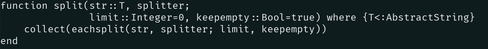
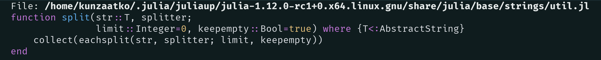

+++
title = "Tips for the Julia <code>startup.jl</code> file"
date = 2025-09-05

description = """
Some small glints and tips for the <code>startup.jl</code> that I find useful when using Julia interactively in the REPL.
"""

[taxonomies]
tags = ["Julia", "glints", "REPL", "tip"]
categories = ["Programming"]

[extra]
# toc = true
+++
If you spend your day hours switching between an editor, paper and the Julia REPL you surely know about the
  [`startup.jl`](https://docs.julialang.org/en/v1/manual/command-line-interface/#Startup-file) file.
Most people use it for loading packages that they use often enough that they value of having the package functionality
  available at startup is higher than the price of the REPL startuptime.
The library packages that meet this criterium for me are
  [`BenchmarkTools`](https://juliaci.github.io/BenchmarkTools.jl/stable/) and [`Makie`](https://docs.makie.org/dev/). 
It is always a good idea when loading package for interactive use to include them conditionally only when the session is
  _interactive_ by 
```julia
try
    if isinteractive()
        using Makie
    end
catch e
    @warn "Error initializing Makie" exception = (e, catch_backtrace())
end
```
This way you are only paying the expense when you actually need it and not when running scripts or generating
  documentation for example.


Non-library packages that may improve your experience with the Julia REPL that I use are 
- [`Revise`](https://timholy.github.io/Revise.jl/stable/): It has become more of a must have in the community and is
  also recommended by the official Julia documentation. It manges the changes that you make in your loaded packages and
  allows the REPL environment to reflect changes that you make in real time.
- [`OhMyRepl`](https://kristofferc.github.io/OhMyREPL.jl/latest/): Features include syntax highlighting in your REPL,
  markdown syntax for documentation and fuzzy searching with [`fzf`](https://github.com/junegunn/fzf) of the REPL
  history.
- [`VimBinding`](https://caleb-allen.github.io/VimBindings.jl/): Enables editing the command line with modal Vim
  bindings.

It is also useful to define some functions that you can use for exploration and debugging purposes. 
For example, I have a `subtypetree` function which allows me to see all of the subtypes of a particular abstract type to
  decide on what interfaces I should use for my own implementations.

It works like this
```jl-repl 
julia> subtypetree(Integer)
Integer
  Bool
  GeometryBasics.OffsetInteger
  Signed
    BigInt
    Int128
    Int16
    Int32
    Int64
    Int8
  Unsigned
    UInt128
    UInt16
    UInt32
    UInt64
    UInt8
```

<details>
<summary>Definition of <code>subtypetree</code></summary>
<pre class="language-julia" data-lang="julia" style="color:#fdf4c1aa;background-color:#282828"><code class="language-julia" data-lang="julia"><span style="color:#fa5c4b">function </span><span style="color:#8ec07c">subtypetree</span><span>(roottype, level=1, indent=2)
</span><span>    level </span><span style="color:#fe8019">== </span><span style="color:#d3869b">1 </span><span style="color:#fe8019">&amp;&amp;</span><span> println(roottype)
</span><span>    </span><span style="color:#fa5c4b">for</span><span> s </span><span style="color:#fa5c4b">in</span><span> subtypes(roottype)
</span><span>        println(join(fill(</span><span style="color:#b8bb26">" "</span><span>, level </span><span style="color:#fe8019">*</span><span> indent)) </span><span style="color:#fe8019">*</span><span> string(s))
</span><span>        subtypetree(s, level </span><span style="color:#fe8019">+ </span><span style="color:#d3869b">1</span><span>, indent)
</span><span>    </span><span style="color:#fa5c4b">end
</span><span style="color:#fa5c4b">end
</span></code></pre>
</details>

Also you might want to integrate some tools that you use in your system and use them instead of the defaults. 
One nice enhancement that I have in this category is using `bat` instead of `less` for the default in the
  `InteractiveUtils.less` function.
You can achieve this by including the code
```julia 
try
    if isinteractive()
        using InteractiveUtils
        function InteractiveUtils.less(file::AbstractString, line::Integer)
            run(`bat --paging=always --line-range $(line): $file`)
            nothing
        end
    end
catch e
    @warn "Error initializing InteractiveUtils" exception = (e, catch_backtrace())
end
```
in your `startup.jl` file. 
This is a game changer for me allowing to switch context between reading code that is run and running the code while
  staying in the REPL using `@less` instead of `@edit` which opens the code in the terminal.
This is before

using `less` as a `$PAGER` by default on a `GNU/Unix` system and this is after

using [`bat`](https://github.com/sharkdp/bat).

I hope you enjoyed this non-exhaustive view into my `startup.jl` and that you found something useful that could make
  your experience a little less frustrating... See you in the next post!
